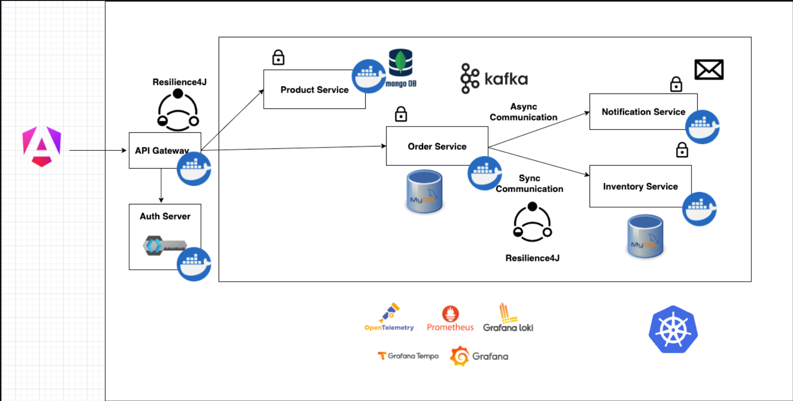
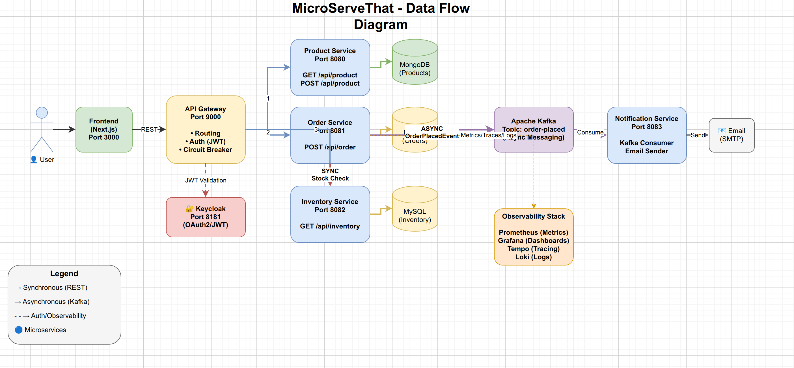
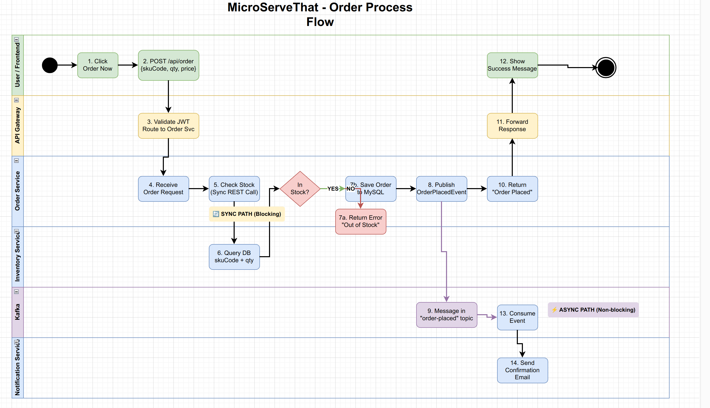
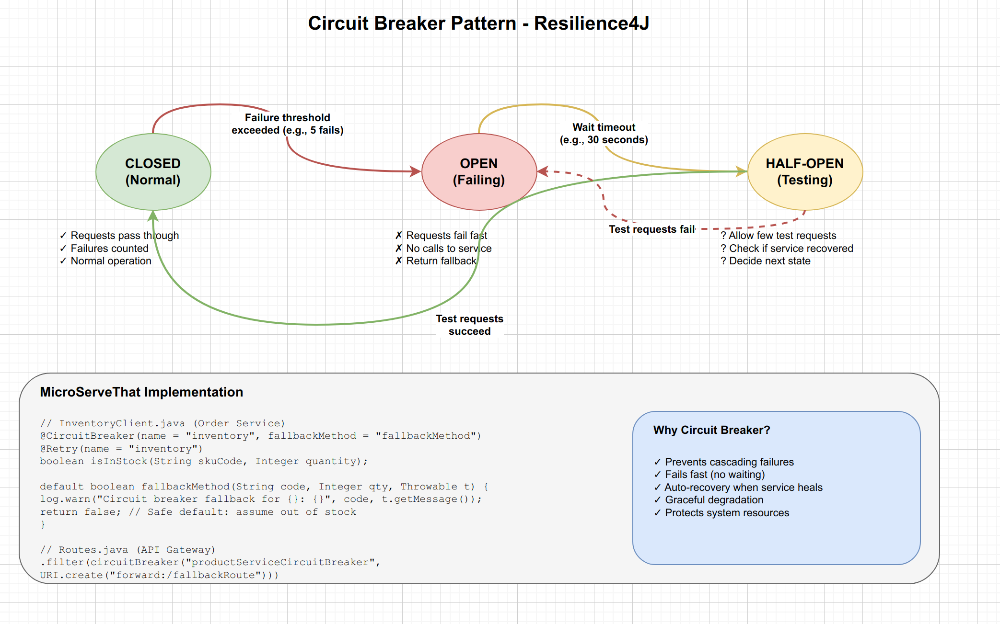

# MicroServeThat

A Spring Boot 3 Microservices application built following the architecture and patterns from [SaiUpadhyayula's Spring Boot 3 Microservices Course](https://github.com/SaiUpadhyayula/spring-boot-3-microservices-course).

> **Reference**: This project was built using the excellent [Spring Boot 3 Microservices Course](https://youtu.be/yn_stY3HCr8?si=EjrBEUl0P-bzSWRG) by Sai Upadhyayula as a learning reference. The original course repository can be found [here](https://github.com/SaiUpadhyayula/spring-boot-3-microservices-course).

---

## Application Architecture



The architecture follows a microservices pattern with:
- **API Gateway** as the single entry point with Resilience4J circuit breakers
- **Auth Server** (Keycloak) for OAuth2/JWT authentication
- **Product Service** with MongoDB for product catalog
- **Order Service** with MySQL for order management
- **Inventory Service** with MySQL for stock management
- **Notification Service** for async email notifications via Kafka
- **Observability Stack** with OpenTelemetry, Prometheus, Grafana, Loki, and Tempo

---

## Data Flow Diagram



This diagram shows the complete data flow through the system:
- **Synchronous communication** (REST) between API Gateway and backend services
- **Asynchronous communication** (Kafka) for order notifications
- **Database per service** pattern with MongoDB and MySQL
- **Observability** data flowing to Prometheus, Grafana, Tempo, and Loki

---

## Order Process Flow



The swimlane diagram illustrates the step-by-step order placement process:
1. User clicks "Order Now" on the frontend
2. Request flows through API Gateway (JWT validation)
3. Order Service receives the request
4. **Sync call** to Inventory Service to check stock
5. If in stock → Save order to MySQL → Publish `OrderPlacedEvent` to Kafka
6. **Async path**: Notification Service consumes event and sends confirmation email
7. Response flows back to user

---

## Circuit Breaker Pattern



The application implements the **Circuit Breaker pattern** using Resilience4J:
- **CLOSED** (Normal): Requests pass through, failures are counted
- **OPEN** (Failing): Requests fail fast, fallback is returned
- **HALF-OPEN** (Testing): Allows test requests to check if service recovered

This prevents cascading failures when downstream services are unavailable.

---

## Services Overview

| Service | Description | Database | Port |
|---------|-------------|----------|------|
| **API Gateway** | Routes requests, circuit breaker, auth | - | 9000 |
| **Product Service** | Product catalog CRUD operations | MongoDB | 8080 |
| **Order Service** | Order placement & management | MySQL | 8081 |
| **Inventory Service** | Stock availability checks | MySQL | 8082 |
| **Notification Service** | Email notifications (Kafka consumer) | - | 8083 |

---

## Tech Stack

| Category | Technologies |
|----------|-------------|
| **Backend** | Spring Boot 3, Spring Cloud Gateway MVC, Spring Security |
| **Frontend** | Next.js 13 (React), Tailwind CSS |
| **Databases** | MongoDB, MySQL |
| **Messaging** | Apache Kafka with Schema Registry (Avro) |
| **Authentication** | Keycloak (OAuth2/OIDC), NextAuth.js |
| **Resilience** | Resilience4J (Circuit Breaker, Retry) |
| **Observability** | OpenTelemetry, Prometheus, Grafana, Loki, Tempo |
| **Containerization** | Docker, Docker Compose |
| **Orchestration** | Kubernetes (planned) |

---

## Prerequisites

Make sure you have the following installed:

- **Java 21** (or later)
- **Maven 3.9+**
- **Docker & Docker Compose**
- **Node.js 18+** and **npm**
- **netcat** (`nc`) for port checking (optional)

---

## Project Structure

```
microservices-k8s/
├── api-gateway/              # Spring Cloud Gateway + Keycloak + Observability
│   ├── docker/
│   │   ├── grafana/          # Grafana dashboards
│   │   ├── keycloak/         # Keycloak realm config
│   │   ├── prometheus/       # Prometheus config
│   │   └── tempo/            # Tempo tracing config
│   └── src/
├── product-service/          # Product catalog (MongoDB)
├── order-service/            # Order management (MySQL + Kafka producer)
├── inventory-service/        # Inventory checks (MySQL)
├── notification-service/     # Email notifications (Kafka consumer)
├── frontend/                 # Next.js frontend application
├── start-all.sh              # Script to start all services
├── stop-all.sh               # Script to stop all services
└── docker-compose.yml        # Root compose file (if present)
```

---

## How to Run

### Option 1: Using the Startup Script (Recommended)

```bash
# Make the script executable
chmod +x start-all.sh

# Start all services (infrastructure + microservices)
./start-all.sh
```

The script will:
1. Start infrastructure (MongoDB, MySQL, Kafka, Zookeeper, Schema Registry)
2. Start Keycloak and observability stack (Prometheus, Grafana, Loki, Tempo)
3. Start all microservices in the correct order
4. Wait for each service to be healthy before proceeding

### Option 2: Manual Startup

#### Step 1: Start Infrastructure

```bash
# Start MongoDB (for product-service)
cd product-service
docker compose up -d

# Start MySQL, Kafka, Zookeeper (for order-service)
cd ../order-service
docker compose up -d

# Start Inventory MySQL
cd ../inventory-service
docker compose up -d

# Start Keycloak + Observability Stack
cd ../api-gateway
docker compose up -d
```

#### Step 2: Start Microservices

```bash
# Start each service (in separate terminals)
cd product-service && ./mvnw spring-boot:run
cd order-service && ./mvnw spring-boot:run
cd inventory-service && ./mvnw spring-boot:run
cd notification-service && ./mvnw spring-boot:run
cd api-gateway && ./mvnw spring-boot:run
```

#### Step 3: Start Frontend

```bash
cd frontend
npm install
npm run dev
```

---

## Stopping Services

```bash
# Using the stop script
chmod +x stop-all.sh
./stop-all.sh
```

---

## Accessing Services

| Service | URL |
|---------|-----|
| **Frontend** | http://localhost:3000 |
| **API Gateway** | http://localhost:9000 |
| **Keycloak Admin** | http://localhost:8181 (admin/admin) |
| **Grafana** | http://localhost:3001 |
| **Prometheus** | http://localhost:9090 |
| **Swagger UI (Products)** | http://localhost:9000/product-service/api-docs |
| **Swagger UI (Orders)** | http://localhost:9000/order-service/api-docs |
| **Swagger UI (Inventory)** | http://localhost:9000/inventory-service/api-docs |

---

## API Endpoints

### Product Service
```
GET    /api/product          - Get all products
POST   /api/product          - Create a product
```

### Order Service
```
POST   /api/order            - Place an order
```

### Inventory Service
```
GET    /api/inventory        - Check inventory (skuCode, quantity)
```

---

## Key Differences from Reference Project

| Aspect | Original Course | This Project |
|--------|----------------|--------------|
| Frontend | Angular 18 | Next.js 13 (React) |
| Package Namespace | `com.techie.microservices` | `com.vihaanthat.microservices` |
| Auth Frontend | angular-auth-oidc-client | NextAuth.js |
| Gateway URLs | Externalized config | Hardcoded localhost |

---

## Acknowledgments

This project was built as a learning exercise following the excellent **Spring Boot 3 Microservices Course** by **Sai Upadhyayula**.

- 📺 **YouTube Tutorial**: [Spring Boot 3 Microservices](https://youtu.be/yn_stY3HCr8?si=EjrBEUl0P-bzSWRG)
- 💻 **Original Repository**: [SaiUpadhyayula/spring-boot-3-microservices-course](https://github.com/SaiUpadhyayula/spring-boot-3-microservices-course)

---

## License

This project is for educational purposes, following the patterns demonstrated in the reference course.

---

## Contributing

Feel free to open issues or submit pull requests for improvements!